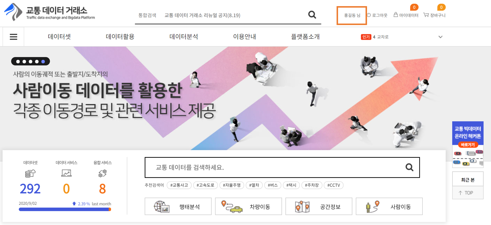
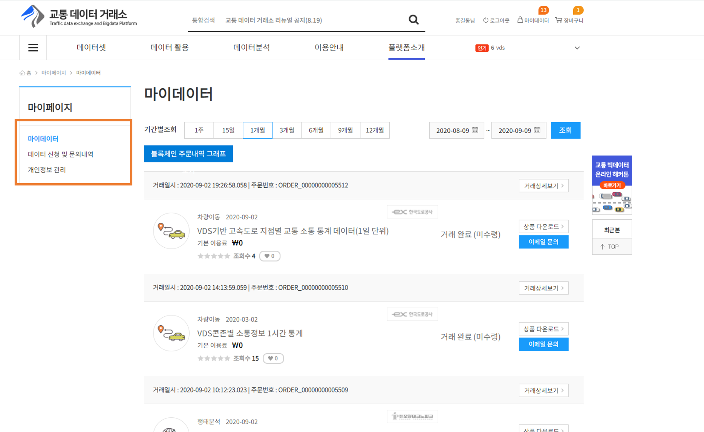
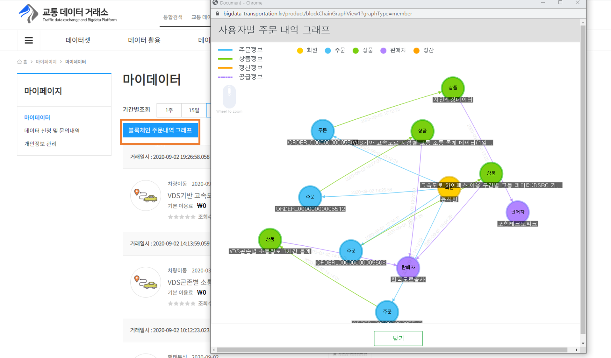
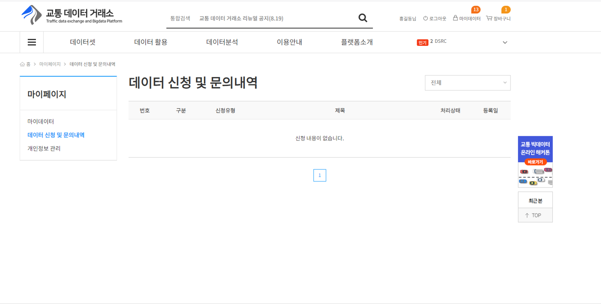
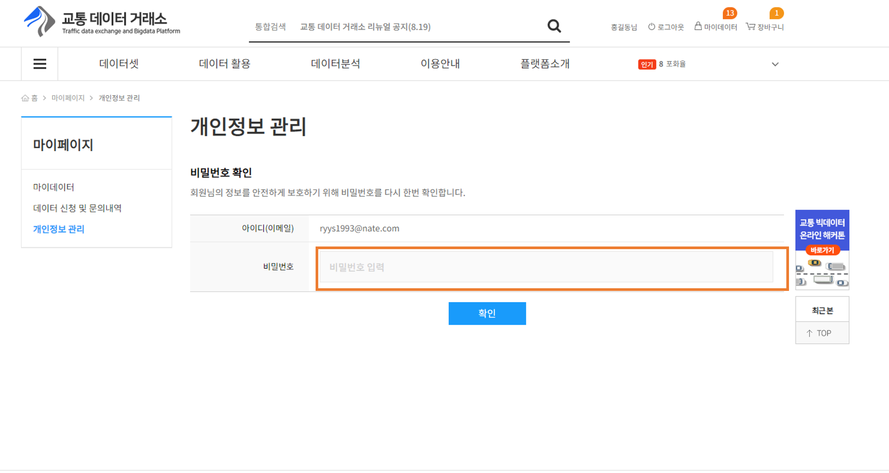
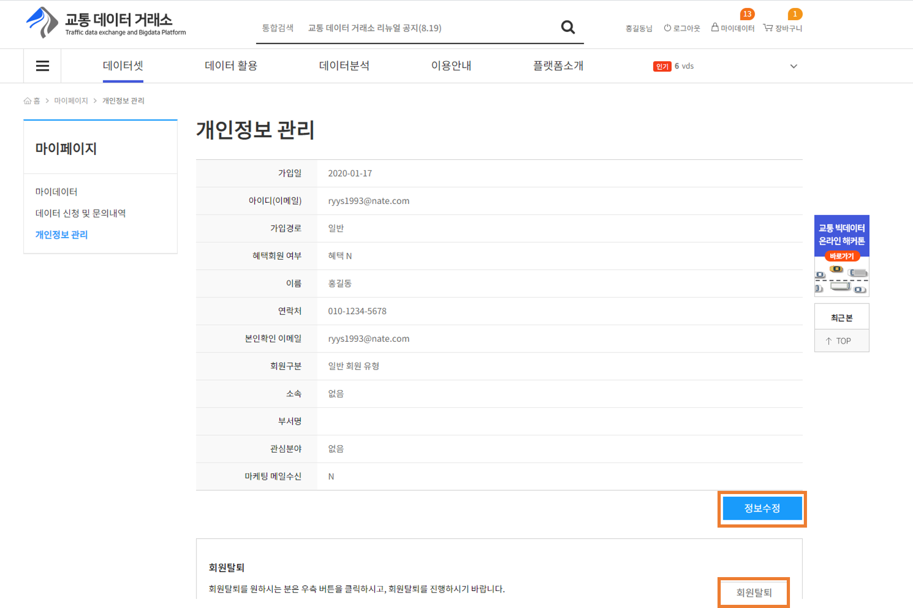
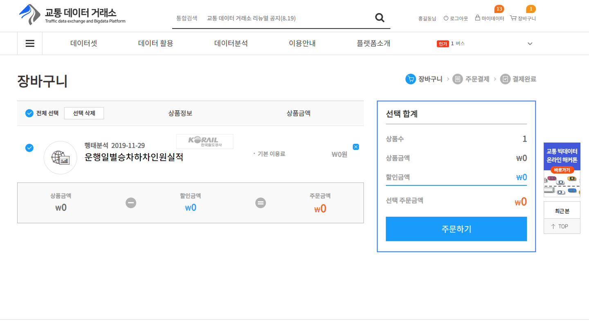

유통 포털 메뉴얼
=========================

1단계) 유통포털에 로그인
-----------------------

유통 포털을 사용하기 위해서는 홈페이지에 로그인 절차를 진행한후에 데이터를 구매해서 오픈랩을 이용 할수 있습니다

로그인을 진행하여 정상적으로 로그인이 되었으면 이제 유통 포털을 이용할 준비가 되었습니다

계정이 없다면, 위의 회원가입 버튼을 눌러서 회원가입을 진행하실 수 있습니다.

2단계) 데이터 상품 구매
-----------------------

데이터 상품을 구매하여, 오픈랩을 이용할 수 있으며

데이터 상품 구매 및 오픈랩 사용방법은 아래 링크를 확인해주시길 바랍니다.

https://docs.diamond-e.kr/manual/OPENLAB-Tutorial/index.html

3단계) 마이 데이터/장바구니
-----------------------

포탈 상위의 마이데이터 버튼을 클릭하면 본인의 마이데이터, 데이터 신청 및 문의내역, 개인정보 관리 창을 볼 수 있습니다.

마이데이터 에서는 본인이 구매한 데이터 목록을 조회할 수 있고, 블록체인 주문내역 그래프를 볼 수 있습니다.

데이터 신청 및 문의 내역에서는 본인의 데이터 신청 및 문의내역을 볼 수 있습니다.

개인정보 관리에서 패스워드를 입력하면 개인정보 관리 페이지로 이동합니다.

개인정보 수정 및 회원 탈퇴 버튼을 이용해서 개인정보를 수정하거나 회원 탈퇴를 할 수 있습니다.

포탈 상위의 장바구니 버튼을 클릭하면 본인이 데이터 상품에서 장바구니에 담아 두었던 상품을 모아 볼 수 있습니다.

주문하기 버튼을 클릭하면 결제하기 페이지로 이동합니다.

